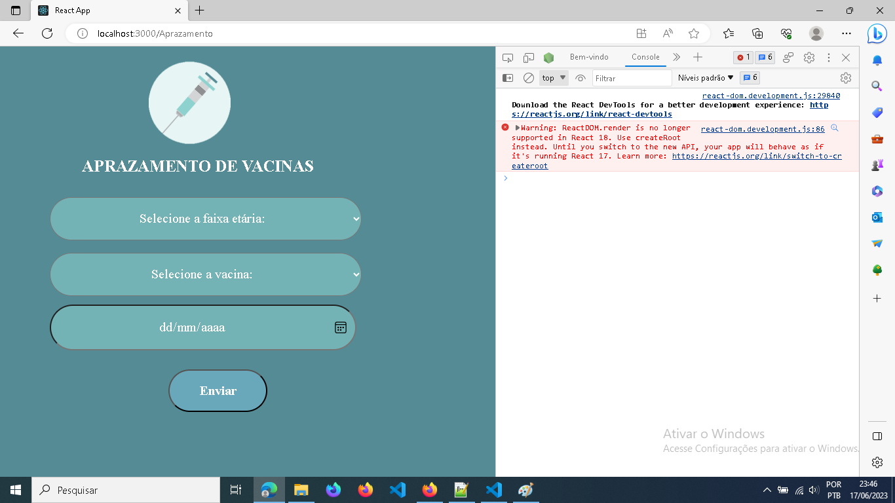
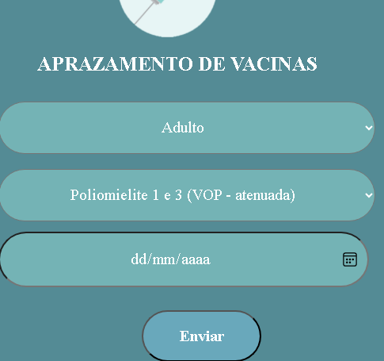

<h3 align="center">
  Ferramenta para verificação de aprazamento de vacinas.
</h3>

<p align="center">Projeto inicializado com create-react-app.</p>
<p align="center">Uso de PureComponents.</p>
<p align="center">Rotas através do react-router-dom.</p>


## PROGRAMADORas

- [Sophia Pinto](https://github.com/sophiapinto)
- [Elisa](https://github.com/sophiapinto)


## 🚀 Tecnologias

- ⚡ NodeJS

## ✋🏻 Pré-requisitos

- [Node.js](https://nodejs.org/en/)
- [Yarn](https://yarnpkg.com/pt-BR/docs/install)

## 🔥 Instalação e execução

1. Faça um clone desse repositório;
2. Entre na pasta `projeto-react`;
3. Rode `yarn` para instalar as dependências;
4. Rode `yarn start` roda o projeto.

<!--
## ⚡️ Como contribuir
- Faça um fork desse repositório;
- Cria uma branch com a sua feature: `git checkout -b minha-feature`;
- Faça commit das suas alterações: `git commit -m 'feat: Minha nova feature'`;
- Faça push para a sua branch: `git push origin minha-feature`.
Depois que o merge da sua pull request for feito, você pode deletar a sua branch.
## 📝 Licença
Esse projeto está sob a licença MIT. Veja o arquivo [LICENSE](LICENSE.md) para mais detalhes.
 -->
---
Feito com 💖 by Elisa e Sophia Pinto.

## Obervações importantes

### Sobre o gerenciador de pacotes

- Ao utilizar `yarn` não se pode usar o `npm` para instalar dependências.
- Utilizar dois gerenciadores de pacote no mesmo projeto pode gerar problemas de compatibilidade de dependências, e causar o problema que eles vieram para resolver -- "Funciona na minha maquina"

Dito isto, utilize apenas o `yarn`, como foi citado em ["Pré-requisitos"](#-pré-requisitos), este é o gerenciador de pacotes oficializado neste projeto.

**Para seguir essa boa pratica, é necessário:**

- deletar o arquivo [/package-lock.json](/package-lock.json)
- Utilizar `yarn add nome-do-pacote-que-deseja-instalar` no lugar de `npm install nome-do-pacote...`

### Sobre o código react

Ao executar o servidor, e abrir o console no navegador é possível observar os erros que o projeto apresta naquela página, recomendo acessarem com frequência essa ferramenta e não ignorar os erros apresentados.

- Abaixo o erro que aparece na pagina inicial, esse erro vai aparecer em todas as subpaginas, pois é um erro no nivel do arquivo [src/index.js](src/index.js)


> Como a maioria dos erros, ele mesmo ensina como corrigir, no caso esse erro é causado pela atualização do react 17 para o react 18, onde o componente de renderização foi alterado, nesse link ensina a corrigir: [https://reactjs.org/link/switch-to-createroot](https://reactjs.org/link/switch-to-createroot)

- Clicando no botão "Acessar", carrega o print abaixo, com novos erros:


>.
> Esse erro é bem comum, diz que foi usado na html o nome `class` e no react, para evitar problemas com a palavra reservada "class", é usado `className` para referencias as classes do CSS
>
> Para corrigir esse erro é necessario ir nos arquivos:
>
> - [/src/components/PrazoVacinas/index.js](/src/components/PrazoVacinas/index.js)
> - [/src/components/Selection/index.js](/src/components/Selection/index.js)
>
> e substituir "`class`" por "`className`"
>
> 

- na pagina [http://localhost:3000/Aprazamento](http://localhost:3000/Aprazamento)


> Encontramos 2 erros
>
> - o primeiro é bem comum,
>
> ```Warning: Each child in a list should have a unique "key" prop.```
>
> Traduzindo, fica:
>
> ```Aviso: Cada filho em uma lista deve ter uma propriedade "chave" exclusiva.```
>
> Diz que o react necessita de um id key para os componentes criados em lote, fácil de resolver,
>
> ---
>
> - o segundo erro:
>
> ```Warning: Use the`defaultValue` or `value` props on <select> instead of setting `selected` on <option>.```
>
> traduzindo, fica:
>
> ```Aviso: Use os props `defaultValue` ou `value` em <select> em vez de definir `selected` em <option>.```
>
> ---
> A tradução é bem auto explicativa, como disse antes, no próprio aleta do erro vem o que deve ser feito para corrigir
>
> <details>
>   <summary>SPOILER</summary>
>   Infelizmente o erro de verdade é de lógica🤦‍♂️, mesmo
> </details>

<!-- ---------------------- -->
<!-- Correção do ERRO 4 -->
<!-- ---------------------- -->

#### Para corrigir o primeiro erro
>
> primeiro vamos no arquivo onde o erro está acontecendo, para localizar esse componente com erro:
>
> 1. vamos nas rotatas, que no caso está localizado em [src/pages/Aprazamento/index.js](src/pages/Aprazamento/index.js)
> 2. Identificamos qual componente da rota "/Aprazamento"
>
> ```js
> <Route exact path= "/Aprazamento" component = {Aprazamento} />
> ```
>
> No caso é a de mesmo nome "Aprazamento"
> 3. vamos no inicio do codigo das rotas e identificamos de onde foi importado esse componetne
>
> ```js
>  import Aprazamento from './pages/Aprazamento';
>```
>
> Logo identificamos que a importação é da localizaçao: './pages/Aprazamento'
> 4. então vamos para o arquivo da lozalizção: [src/pages/Aprazamento/index.js](src/pages/Aprazamento/index.js)
>
> 5. Analizando o codigo:
>
> ```js
> import PrazoVacinas from '../../> components/PrazoVacinas';
> 
> function Aprazamento () {
>   return (
>     <div>
>       <PrazoVacinas />
>     </div>
>   );
> }
> 
> export default Aprazamento;
> ```
>
> Identificamos que o erro deve estar no componente `PrazoVacinas`, localizado em [src/components/PrazoVacinas/index.js](src/components/PrazoVacinas/index.js)
>
> Analizando o codigo por estruturas de repetição, encontramos o **.map** nas **linhas 52** e **61**
>
> ```js
> 52 dados.categorias.map((v,i)=> <option value={i}> {v.titulo} </option>
> ```
>
> ```js
> 61 dadosVAC.map((v,i)=> <option value={i}> {v.vacina} </option>
> ```
>
> **A correção:**
> é só colocar o atributo `key = chave-unica`, em cada componente gerado pelos map:
>
> ```js
> 52 dados.categorias.map((v,i)=> <option key={i} value={i}> {v.titulo} </option>
> ```
>
> ```js
> 61 dadosVAC.map((v,i)=> <option key={i} value={i}> {v.vacina} </option>
> ```

<!-- ---------------------- -->
<!-- correção do ERRO 5 -->
<!-- ---------------------- -->
#### Para corrigir o segundo erro
>
> Seguindo os passsos de rastreamento de erros, descrito [no erro anterior](#para-corrigir-o-primeiro-erro)
>
> chegamos no  componente **PrazoVacinas**, localizado em [src/components/PrazoVacinas/index.js](src/components/PrazoVacinas/index.js)
>
> Analisando o código, encontramos o uso de `selcted` em **duas linhas: 50 e 59**
>
> ```js
> 49 <select className="pesquisa-faixa-etaria" type="checkbox" value={this.state.value} onChange={this.handleChange}>
> 50 <option value="" disabled selected>Selecione a faixa etária:</option>
> ```
>
> ```js
> 58 <select className="pesquisa-vacina" type="checkbox" value={this.state.value} onChange={this.handleChange}>
> 59 <option value="" disabled selected>Selecione a vacina:</option>
> ```
>
> Para sumir com o aleta de erro basta, deletar a tag `selected`, pois:
>
> - Para o elemento `<select>` pai deste `<option>`
>
> ```js
>  value={this.state.value}
> ```
>
> - e na linha 13 é definido que value = ''
>
> que é exatamente o valor do option que possuía o `selcted`
> `<option value="" ...`
>
> logo, value em `<select>` já define este `<option>` como o default
>
> 
>
> tanto é verdade, que com essa correção agora os erros sumiram, e o valor padrão desses input por `<select>` é os desejados

### Agora vem a correção do erro de lógica na pagina Aprazamentos

O erro se da nos inputs, com valores associados erroneamente

#### Como reproduzir o erro

1. Abra a pagina <http://localhost:3000/Aprazamento>
  

2. Selecione qualquer coisa no primeiro select
  

3. Repare que o valor no segundo input select foi alerdado
  

4. modifique o valor no segundo select, e repare que o valor selecionado anteriormente no primeiro select foi alterado
  

- Coincidentemente, os valores são alterados para os respectivos `options` em ordem de posição
  

**Dedução:**

`"sempre vai mudar em par, com o par da mesma posição"`

Isso que você deve tá pensando, mas vamos testar essa teoria.

#### Testes Extras

A teoria **sempre vai mudar em par, com o par da mesma posição** é verdade

-  a menos que selecione no segundo `select` uma posição de numero maior que o tamanho da lista do primeiro `select`, neste caso o navegador buga e seleciona o primeiro `option` selecionavel na lista
  

- lembra do que eu falei de analisar o console?
  Pois bem, durante toda essa alteração, observe o que apareceu no console:
  

- no mínimo isso é intrigante.
  Ele tá falando value "X" com x sendo exatamente a posição que estávamos selecionando nos inputs select. 
  
  
  E ainda tem mais, ele diz que esse numero não está no formato de data, que é exatamente o tipo do terceiro input que não mexemos ainda
  

- E bora mexer nesse input data, e ver o que acontece
  

  Uma alteração sutil aconteceu, mas não teve erro no console. 
  
  
  Os valores dos primeiros select foram setados para o primeiro valor selecionável. Assim como aconteceu com o primeiro select quando modificamos o segundo select para uma posição acima da quantidade disponível no primeiro

- Ultimo teste: modificar um dos select e observar o que acontece com a data



A data simplesmente foi limpa, apareceu aqueles erros no console, e o outro select se modificou para o par da mesma posição

**Preciso dizer mais algo? ou já conseguiu formular uma teoria do porque isso ta acontecendo?**
