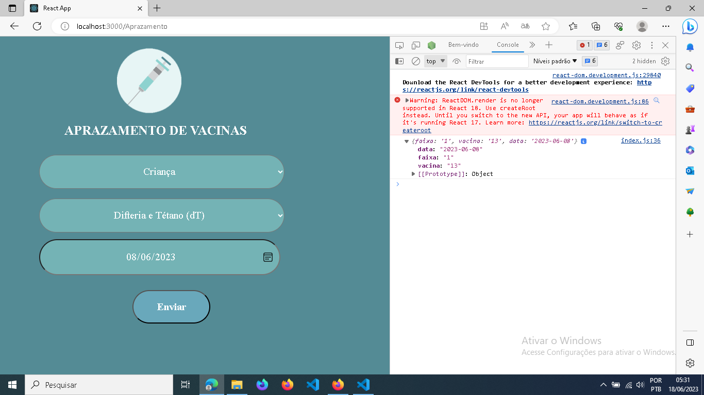

# Resolução do erro de logica do componente PrazoVacinas

O componente **PrazoVacinas** está  localizado em [/src/components/PrazoVacinas/index.js](/src/components/PrazoVacinas/index.js)

Erro relatado no [/README.MD#agora-vem-o-erro-de-lógica-na-pagina-aprazamentos](/README.md#agora-vem-o-erro-de-lógica-na-pagina-aprazamentos)

## Comentário sobre o erro

O erro acontece pois todos os inputs (incluindo os do tipo select) estão usando a mesma referencia de value, que é definida na [linha 13](/src/components/PrazoVacinas/index.js#L13) como:

```jsx
13        this.state = {value: ''};
```

### modificado pelas funções

- [handleChange](src/components/PrazoVacinas/index.js#L20)
  
  ```jsx
  handleChange(event) {
    this.setState({value: event.target.value});
  }
  ```

  - [handleDate](/src/components/PrazoVacinas/index.js#L24)

  ```jsx
  handleDate(event) {
    this.setState({value: event.target.  value});
  }
  ```

### e usado em (todos os input e no alert)

```jsx
29 // const result = this.state.value.slice();
```

```jsx
34 alert('A data da próxima vacina é: ' + this.state.value);
```

```jsx
49 <select className="pesquisa-faixa-etaria" type="checkbox" value={this.state.value} onChange={this.handleChange}>
```

```jsx
58 <select className="pesquisa-vacina" type="checkbox" value={this.state.value} onChange={this.handleChange}>
```

```jsx
67 <input type="date" className="pesquisa-data" value={this.state.value} onChange={this.handleDate}/>
```
<!--  -->

Então logicamente que um dos input sendo alterado, a função respectiva sobrescreve o valor da variável e todos os outros input recebem esse novo valor

Para corrigir essa logica, necessita:

- que cada input receba um state.value diferente,
- e que a função que modifica state.value trate a informação modificando a variável do input respectivo, e não a variável de todos os input.

## Construindo a Solução

Em vez de usar state.value como sendo uma só variável, podemos atribuir a ele um objeto, estilo json, onde existe uma estrutura de {**chave** : **valor**}.

**Onde:**

1. Cada chave se refere ao input específico
2. Cada valor é o valor armazenado e coletado pelo input

Sendo assim, a nova linha 13 será algo como:

```jsx
13        this.state = {values:{value1: '', value2:'', value3:''}};
```

ajustando para nossa realidade:

```jsx
13        this.state = {values:{ faixa: '', vacina: '', data: '' }};
```

agora precisamos atualizar essas informações em dois lugares:

1. Nas [funções que modificam/usam](#modificado-pelas-funções) os valores recebidos nos inputs
   - [handleChange](/src/components/PrazoVacinas/index.js#L20)
   - [handleDate](/src/components/PrazoVacinas/index.js#L24)

2. Nas [linhas que utilizam](#e-usado-em-todos-os-input-e-no-alert) os valores salvos no state

<!-- > por exemplo, vou utilizar apenas um `select` -->
<!-- ### Revisão

Antes de começar a reescrever a função, vamos lembrar dos seletores css, existe algumas formas selecionar um elemento com css, e no JS essas funções/métodos são espelhados.
Para relembrar, acesse esse arquivo: [/dj_notas/Formas-de-selecionar-com-css.md](/dj_notas/Formas-de-selecionar-com-css.md)

Para formulários, geralmente utilizamos as Props `NAME` e `ID` -->

### Alteração no codigo
<!-- 
Então vamos na na linha do input, e adicionais a prop name, com o nome da variável que queremos para essa informação coletada pelo input
**exemplo, no input de data,** colocamos `name="data"` -->

```jsx
67 <input 
    value={this.state.values.data} 
    type="date" 
    className="pesquisa-data" 
    onChange={this.handleDate}
/>
```

> repara que alterei value para `value={this.values.data}`

desta forma, conseguimos separar os valores do input
<!-- 
- Presumindo que estamos no desconhecido, e sabendo que a função handleDate recebe um atributo passado pela função que o chama,
   -->
- Vamos na função handleDate

 e colocamos para ela receber esse valor e modificar/salvar no `stete.data` (`data` é a chave, o nome da variável que eu escolhi para salvar a informação)

 ```jsx
 handleChange(event) {
    this.setState({value:{data: event.target.value}});
 }
 ```

**A pergunta é, isso vai funcionar?**
R: sim e não, quando o ususario modificar a data, apagara todo o state e colocará a informação data:valor no lugar.

o que precisamos é que somente o atributo data seja alterado de state,
e como fazer isso?

Existem diversas formas,
exemplo:

```jsx
handleChange(event) {
    const nova_values = this.state.values;
    nova_values.data = event.target.value;
    this.setState(nova_values);
}
```

A que eu gosto de usar é a mais minimalista de todas, em vez de passar o valor para setState, eu passo uma função
  
- Essa função recebe um valor, que é justamente o valor atual de state, com isso conseguimos modificar o atributo desse valor e salvar em state em uma só linha

```jsx
handleDate(event) {
    this.setState((x) => x.values.data = event.target.value);
}
```

Da mesma forma, vamos alterar a função que modifica/salva os valores dos select

- mas ai chegamos num impasse, como a função vai saber qual o input select chamou ela?
- 1. Existe o método automatizado
- 2. Existe o método didático
como você pulou muitos passos para criar esse sistema, e não se lembra do que fizemos no inovOnline, vou te direcionar para o método 2, o didático.

O método didático consiste em **criar uma função handleChange** diferente para cada input do formulário, você já até começou fazendo isso, ao separar o **handleChange** para os select e o **handleDate** para o **input[type='date']**

```jsx
handleChangeFaixaEtaria(event) {
    this.setState((x)=>x.values.faixa = event.target.value);
}
handleChangeVacina(event) {
    this.setState((x)=>x.values.vacina = event.target.value);
}
```

- e novamente precisamos espelhar essa alteração nas linhas dos select

  - Select: pesquisa-faixa-etaria

    ```jsx
    <select    
        className="pesquisa-faixa-etaria" 
        type="checkbox" 
        value={this.state.values.faixa} 
        onChange={this.handleChangeFaixaEtaria}
    >
    ```

  - Select: pesquisa-vacina

    ```jsx
    <select 
        className="pesquisa-vacina" 
        type="checkbox" 
        value={this.state.values.vacina} 
        onChange={this.handleChangeVacina}
    >
    ```

- por conta da alteração de nome e criação de uma nova função (e principalmente pelo fato de usarem PureComponent) vamos precisar atualizar o **constructor(props)**

    ```DIFF {language=jsx}
    constructor(props) {
        super(props);
        this.state = {value: ''};
    
    -    this.handleChange = this.handleChange.bind(this);
    +    this.handleChangeFaixaEtaria = this.handleChangeFaixaEtaria.bind(this);
    +    this.handleChangeVacina = this.handleChangeVacina.bind(this);

        this.handleSubmit = this.handleSubmit.bind(this);
        this.handleDate = this.handleDate.bind(this);
    }
    ```

- e, espelhar a alteração no alert da função handleSubmit

``` jsx
alert('A data da próxima vacina é: ' + this.state.values.data);
```

> ⚠ apesar de ainda não fazer sentido printar a data fornecida no input como sendo a data da próxima vacina

## por fim, para finalizar essa revisão

1. os `<select>` desta pagina possuem o tipo "checkbox", isso é errado, pois:
   - a tag `<select>` não possui o atributo type;
   - o tipo checkbox é um formato de input conforme a imagem abaixo
   
   exemplo: <input type="checkbox"> que é gerado pelo codigo: `<input type="checkbox">`

2. como dica de como processar esses dados enviados pelo forms

    ```jsx
    handleSubmit(event) {
        console.log(this.state.values)
    }
    ```

    vai resultar em:
    

    ```json
    {
        "faixa": "1",
        "vacina": "13",
        "data": "2023-06-08"
    }
    ```

## Código alterado

A compilação deste documento em um script se encontra na bifurcação "corrigindo erro de formulário" [Neste LINK](https://github.com/djedu28/aprazamento/blob/409b960a3f74fec2795d6d44e5081971982706cf/src/components/PrazoVacinas/index.js#L13)
